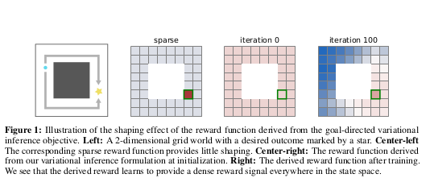

# Outcome Driven Reinforcement Learning via Variational Inference

Tim G.J Rudner - Oxford
Vitchyr H Pong - UC, Berkeley
Rowan McAllister - UC, Berkeley
Yarin Gal - Oxford
Sergey levine - Uc, Berkeley

35th Conference on Neural Information Processong Systems (NeurIPS 2021)

      Rudner, T. G., Pong, V., McAllister, R., Gal, Y., & Levine, S. (2021). Outcome-driven reinforcement learning via variational inference. Advances in Neural Information Processing Systems, 34, 13045-13058.

## Abstract

* Reinforcement Algorithms provide automated acquisition of optimal policies
  * Practical Application requires manually designing function that not only define the task, but also provide sufficient shaping to accomplish it.
* This paper views the problem of RL as inferring policies that achieved desired outcomes, instead of maximizing reward.
* They propose a a novel variational inference formulation that allows them to derive a well-shaped reward function that can be learn directly from environment interactions
* From the corresponding variational objective:
  * They derive a new probabilistic Bellman backup operator
  * Use it to develop an off-policy algorithm to solve goal-directed tasks
  * Demonstrate that their method eliminates the need for hand-crafted reward functions, leads to effective goal-directed behaviours.

## Introduction

Design of the Reward Function

* Has a very big impact on the resulting policy
* It's very heuristic, lacks theoretical grounding, can make effective learning difficult, can lead to reward mis-specification

Alternative

* Instead of framing the problem as finding a policy that maximizes a heuristically-defined reward function
* Express it as inferring a state-action trajectory that distribution conditioned on a desired future outcome

* Builds off on probabilistic perspectives on RL and goal-directed RL
* The paper derives:
  * A tractable variational objective
  * A temporal-difference algorithm that provides a shaping-like effect for effective learning
  * A reward function that captures the semantics of the underlying decision problem and facilitates effective learning
  
Outcome-Driven Actor-Critic - Resulting Algorithm

* Ameniable to off-policy learning
* Applicable to complex, high dimensial continuous control tasks over finite or infinite horizons.
* The resulting variational algorithm can be interpreted as a shaping method, where each iteration learns a reward function that automatically provides dense rewards (Figure 1)

* Works on tabular, non-tabular and deep learning approximation settings

Contributions

1. Probabilistic formulation of a general framework for inferring policies that lead to desired outcomes
2. Derivation of a variational objective from which we obtain a novel outcome-driven Bellman backup operator
3. Show that this Bellman backup operator induces a shaping-like effect and a clear and dense learning signal even in the first stages of training - this shaping emerges automatically from variational inference
4. Demonstrate that the resulting variational objective is lower-bound on the log-marginal likelihood of achieving the outcome given the initial state + leads to an off-policy temporal-difference learning algorithm.
5. We evaluate this algorithm - Outcome Driven Variational Inference (ODAC) -> results in significantly faster learng accross a variety of robot-manipulation and locomotion tasks.

## Sections

1. Introduction
2. Preliminaries
   1. Goal-conditioned Reinforcement Learning
   2. Q-Learning
3. Outcome-Driven Reinforcement Learning
   1. Warm-up: Achieving a Desired Outcome at a fixed time-step
   2. Outcome-driven Reinforcement Learning as Variational Inference
4. Outcome-Driven Reinforcement Learning
   1. Outcome-driven Policy Iteration
   2. Outcome-driven Actor-critic
5. Related Work
6. Empirical Evaluation
   1. Learning to achieve desired outcomes
      1. Environments
      2. Goal sampling
      3. Baselines and prior work
      4. Results
   2. Ablation Study on the effect of a variational discount factor
7. Conclusion

## Conclusion

* ODAC - Outcome-Driven Actor Critic leads to efficient outcome-driven approaches to RL
* It works well with simple dynamics models and suppose that also for more sophisticated ones: future area of research (epistemic uncertainty, domain specific structure)

