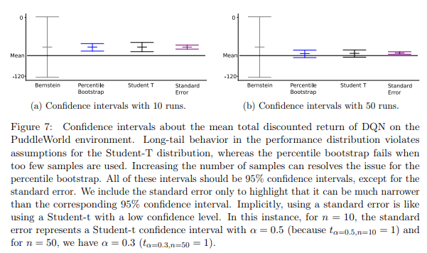

# [Empirical Design in Reinforcement Learning](https://arxiv.org/pdf/2304.01315)

## Abstract

* Recent studies have highlighted how popular algorithms are sensitive to hyperparameter settings and implementation details, and that common empirical practice leads to weak evidence.
* This manuscript represents both a call to action and a comprehensive resource on how to do good experiments on Reinforcement Learning.
* Covers:
  * Statistical assumptions underlying common performance measures
  * how to properly chracterize performance variation and stability
  * hypothesis testing
  * comparing multiple agents
  * base and illustrative example construction,
  * and how to deal with hyper parameter and experimenter's bias

* The objective is to provide answers on how we can use our unprecedented compute to do good science in Reinforcement Learning, as well as to avoid pitfalls in our empirical design

## Sections

1. Reinforcement Learning, an Empirical Science
2. Observational Experiments
   1. Experiment one: a demonstration
   2. Experiment two: characterizing variations in performance
   3. Distributions matter!
   4. Reporting variability in performance
   5. Reporting confidence in performance estimates
   6. Do we really need more runs?
   7. Deciding on the length of an experiment
3. Dealing with Hyperparameters
   1. Understanding hyperparameter sensitivity
   2. Reporting idealized perfomance
   3. Evaluating algorithms for deployment
4. Comparing the Performance of Multiple Algorithms
   1. Designer's curse: with great knowledge comes great responsability
   2. The utility of calibration baselines: what does that line mean anyway?
   3. Ranking algorithms (maybe don't)
   4. Statistically significant comparisons for two fully-specified algorithms
   5. Statistically significant comparisons for multiple fully-specified algorithms
5. Selecting Environments
   1. Diagnostic environments
   2. Benchmark experiments and challenge problems
   3. New (or modified) environments are not always better
6. Common errors in RL experiments
7. Case study: reevaluating previous work
8. Conclusion

Appendix:

1.  Summary of Contributions
2.  Further Experimental Details
    1.  ESARSA and the GridWorld
3.  Computing Tolerance Intervals
4.  More about Hyperparameter Selection
    1.  Understanding hyperparameter sensitivity for multiple parameters
    2.  Developing algorithms and avoiding misleading yourself
    3.  Why can't we just use cross-validation?
    4.  Cross-validation-like procedures for hyperparameter selection
    5.  Even more about treating the hyperparameter optimizer as the algorithm
5.  Agreggating Environments
6.  Understanding our Agents with Multiple Evaluation Metrics
    1.  Measuring the performance of an agent
    2.  Summarizing performance over time
    3.  Offline returns versus online returns

## 1. Introduction

* Methodology can impact the credibility of the result, ranging from insightful to misleading
* The task of evaluating a RL agent is complicated due to its fundamental aspect: an agent interacting with an environment
  * This interaction makes fair comarisons and scientific reproductivity major challenges in RL
  * Many of the ideas from classical Machine Learning such as overfitting, cross-validation, and model selection are diffferent or non-existent in RL.
  * Thus, the community is experiencing the consequences of limited reproductivity, experimenter bias, unreliable algorithms, and exagerated performance claims
* This document makes a distinction:
  * __demonstrations of (impressive) engineered systems__:
    * exploratory science, probing the edges of what is known before following with a more through empirical study
    * Demonstrating the capabilities of existing algorithms, in hard problems or applications
    * TD-Gammon 1995
  * __scientific studies in RL__:
    * Aim to obtain a deeper understanding of the systems and algorithms
    * Clear hypothesis that is falsifiable and controls for confounding effects
    * The aim should not be to show an algorithm is good, but rather understand an algorithm's properties, potentially relative to other algorithms
    * Complementary to theoretical analysis
* Many of the widely bemoaned poor empirical practices could be due to mistakenly applying practices common in other communities

* This document aims to be a reference to how to run good experiments in RL 
  * Walk through important design decisions, common mistakes, hidden biases


## 2. Observational Experiments

* In an observational study, the experimenters do not attempt to control the outcome of the study.
  * Classic example: "bake_off"-style, where several baseline algorithms are tested along several baseline environments.
* Because much of RL research occurs in deterministic simulation, we can lose sight of our goal as empiricists.
* Goals:
  * Evaluate the quality of a policy through the use of a value function for an specific agent
  * Repeated trials to understand performance accross multiple agents of a given algorithm, environment and experimental setup

Terminology:

* Agent: single entity interacting with an environment
* Algorithm: process which produces a set of agents, by specifying their initial conditions and learning rules
  * Fully-specified algorithm: an algorithm with a specific hyperparameter configuration
  * Unspecified algorithm. algorithm where some (or all) hyperparameters have not been configured

### 2.1 Experiment one: a demonstration

* How well does algorithm A perform on environment E?

* Decisions to be made:
  * How many time steps
  * artificial end of an episode after n steps
  * how many episodes if an episodic task

* Example:
  * If an optimal policy can get to the end in 15 time steps and the discount is 0.99, the optimal episodic return is $0.99^(15)$.
  * Use a fixed number of steps (not episodes!):
    * To better measure online performance
    * To avoid highly variable runtimes
    * Can change depending on what we need to measure
  * The curve has a step profile because just a single run of the experiment and step return.
  * Summarized as the average over the learning curve: return rate : It can change

### 2.2 Experiment two: characterizing variations in performance

* Most of the time we are interested in results that capture the variability of our algorithm
* Two main sources of variability (nature vs nurture)
  * Agent initialization (often randomized)
  * Environment stochasticity
* We do not make claims about an algorithm just from the behaviour of one agent, like scientists don't conclude about a species from one individual rat.

### 2.3 Distributions matter!

* The variability in performance accross agents due to initialization and environment random seed and noise parameters gives rise to a distribution over performance for our algorithm.
* Important for evaluating the algorithms performance and stablishing the number of experiments.


### 2.4 Reporting Variability in Performance

* Distribution-agnostic approaches:
  * Upper and lower percentiles (a,b) that reflect the range of performance
  * **tolerance intervals** and standard deviation
    * Summarize the range of an algorithm's performance while taking into account uncertainity due to a limited number of samples
    * Approach their true values as the sample size grows, unlike confidence intervals, which gro to zero
* It might be useful to measure the mean as well as the median, as the mean is a summary of all agents and the median reflects one agent in particular.


### 2.5 Reporting confidence in performance estimates

* Confidence interval: how certain we are in our estimate of some statistic of the agent's performance. It decreases to zero as number of samples grow
* It is necessary to ask ourseves the number of samples we need to build a reasonable confidence interval.
* Two main ways:
  * T-Student and other statistical methods:
    * Has some assumptions
    * Easier to compute and more precise
  * Bootstrap
    * Has no assumptions or very little
    * Needs more samples, needs a minimum of samples
* Recommendation: Default to bootstrap-based methods for most comparisons, but check the uderlying distributions to see if more powerful methods can be used without breaking assumptions


### 2.6 Do we really need more runs?



* Situations where confidence intervals fail are far from rare, and often we need to do more runs, espcially with agents with highly skewed performance distributions
* One alternative is to do less runs, but calculate the inter-quartile mean:
  * More robust to outliers
  * Careful: ignores potential important extreme values (e.g. 10% of the time the algorithm fails miserably)

### 2.7 Deciding on the length of an experiment

* Number of steps studies:
  * Small number: evaluate early performance
  * Large number: evaluate if the agent can reach near-optimal performance within a reasonable number of samples
  * Very large: evaluate if the agent can reach near-optimal performance and remain stable
* The learning curve tells us:
  * still increasing: early learning
  * flattened for many steps: final performance
  * you can run the agent for longer to see if it eventually levels off, and then report performance for a smaller number of steps to focus on early learning
* Cutoffs:
  * Prevent an episode from becoming too long
  * An agent may be stuck, never finding it's way to the goal, never terminating an episode
  * A cutoff involves teleporting the agent after max-steps back to the start state, without termination.
  * Cutoffs can interact with exploration, and in particular very aggressive short cutoffs may misrepresent the performance of agents that get frequently stuck.
  * Can also be used (though not as necessary) when limiting the number of steps rather than the number of episodes.
  * With a large cutoff, we are much less likely to make the problem too easy and avoid skewing the results, while obtaining some of the reduced variance to facilitate evaluation.

### 2.0 Key insights: Evaluating a fully specified algorithm

1. A single run of an agent can be informative: consider visualizing individual runs to gain some understanding of your algorithm.
2. Agent behaviour can be very different across random seeds: report this variability with sample standard deviations or tolerance intervals, rather than just the summary statistic.
3. Confidence interval tell us the confidence on our statistic estimate, not the variability of the agents. They are useful for understanding mean performance, not the behaviour of each agent.
4. __Do not report standard errors__: low-confidence confidence interval, decide on the confidence interval you need.
5. The required number of runs depends on your performance distribution, which is unknown. 5 runs is insufficient, but 30 can also be when the distribution is heavily skewed.
6. Consider reporting Performance vs Steps of Interaction, rather than performance versus episodes. This choice ensures every agent receives the same number of samples.
7. Deliberately choose the number of steps of interaction to reflect early learning or the ability to learn the optimal policy, rather than what was done in previous work.
8. Aggressive cutoffs can significantly skew the results.

If we truly want to understand our algorithms and gather sufficient evidence for our claims, we need to take the scientific enterprise seriously. Science is first and foremost about understanding, not picking winners and losers.

## 3. Dealing with Hyperparameters

* Three typical goals of our experiment:
  * Understanding of the _variety of behaviours_ produced by our algorithms on different hyperparameter settings
    * There is some knowledge on how to study hyperparameter sensitivity
  * Understanding the _idealized maximum capabilities_ of an algorithm with optimal hyperparameter settings
    * Often limited to benchmark problems
    * Two challenges:
      * Statistical: stochastic functions are hard to maximize
      * It is defficult to ensure a level playing field with similar tuning effort between algorithms
  * Understand the _deployment performance_ that the algorithm is likely to achieve with selected hyperparameters
    * Greatest challenge:
      * Unsupervised learning has a general purpose approach for hyperparameter selection
      * Supervised Learning has cross-validation
      * Reinforcement Learning is less clear on how to use cross-validationa and others
    * Additional challenges:
      * Sim vs real
      * lots of data with limited compute vs limited data and lots of compute
      * Safe vs unsafe exploration
    * Each combination of factors will lead to different methodologies for the selection of hyperparameterss

### 3.1 Understanding hyperparameter sensitivity

* The goal of hyperparameter sensitivity analysis is to help us understand our algorithms.
  * Not supporting SOTA claims!
* Classic example: TD($\lambda$)
  * MonteCarlo: $\lambda \rArr 1$
  * Original: $\lambda \rArr 0$
  * Possible takeaways of one study:
    * 0.9 is optimal
    * variable performance as $\lambda \rArr 1$
    * diverges as $\lambda \rArr 0$
    * performance may suddenly drop off out of a certain range: difficult to tune on other environments
* In order to evaluate our algorithm with different values of a hyperparameter, we need to collect enough data to provide reasonable estimates of our statistic of choice.
  * In the most basic setting (one hyperparameter): N runs for each hyper parater H, N x H runs!!! EXPENSIVE

#### Dealing with a single hyperparameter (you define this parameter and get a fully specified algorithm!)

* Summarizing the performance of a hyperparameter:
  1. Decide on a range
  2. Specify how values are selected within that range.
     * Common: stepsizes of 2
* Possible results:
  * Smooth curve with a bowl or U-shape: Alright!
  * Sharp changes in performance: stepsize too wide
  * If the best performance is at one end: range too narrow -> should be scientifically expanded
* Interpreting the resulting sensitivity curve:
  * Reasonably flat for a wide range of hyperparameters:
    * Insensitive partially specified algorithm
    * Not challenging to define fully for deployment
  * If the sensitivity curve shows a large difference of performance within a narrow range:
    * Highly sensitive partially-specified algorithm
    * Difficult to define fully for deployment
* Comprehensive experiments are expensive:
  * It can be tempting to test only a small number of parameter settings and __compromise__ the empirical design.
  * __There is no point in running a flawed experiment, even if it is more feasible in terms of computation__
  * An alternative choice would be to ask research questions that better match our computational resources.
*  Example: Does TD with momentum diverge?
   *  Without theory -or an infinite number of runs- we cannot know with absolute certainity that TD with momentum diverges
   *  With __empiricism__, we accumulate a body of evidence which supports our claim, with the more random seeds we test and the more hyperparameters values we sweep, the more convincing our body of evidence is.

#### Assesing overall hyperparameter sensitivity

* In addition to explicitly visualizing perfomance versus a specific hyperparameter, we can also attempt to assess overall how sensitive an algorithm is to hyperparameters.
* Jordan et al (2020)
  * Instead of exhaustively trying all combinations
  1.  Treat all hyper parameters as unknown values 
  2.  Model these unknowns as random variables (eg stepsize~Uniform(0,1)) and draw sample hyper parameter configurations
  3.  The amount that the performance changes as we change the hyperparameters then provides a measurement for the sensitivity of under-specified algorithm on a given problem setting.
* Tradeoff:
  * Carefully and systematicallyinvestigate a small number of hyperparameters at a time
  * We can try to investigate the entire space of hyperparameters with much less detail

```
    Developing area of research: Appendix D.1. for more detail.
```

### 3.2 Reporting idealized performance

* When we first introduce an algorithm we may want to know how well it can perform, on an environment
* Very popular but it has several pitfalls:
  * Estimating the maximum of a stochastic function is challenging and may need a very large number of samples
    * Many random seeds
    * Expensive computational costs
  * RL algorithms are notoriously sensible to hyperparameters and often contain dozens of hyperparameters to tune
  * When comparing two algorithms, different number of hyperparameters can cause bias in the difference of performance.

#### Maximization bias

