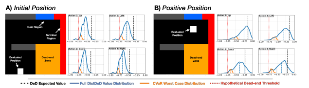
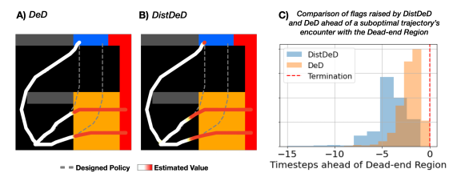

# Risk Sensitive Dead-end Identification in Safety-Critical Offline Reinforcement Learning

One of the problemas highlighted in The Challenge of IA Value Alignment

GREAT PAPER

* Taylor K William - University of Toronto
* Sonali Parbhoo - Imperial College London
* Marzyeh Ghassemi - Massachussets Institute of Technology

## Abstract

* Identifying worst-case scenarios or dead-ends is crucial in safety-critical scenarios
* This situations are rife with uncertainity due to stochastic environments and limited offline training data
* Distributional Dead-End Discovery (DistDeD): a fromework to identify worst-case decision points based on estimated distributions of the return of a decision.
* Used on a toy domain as well as assesing the risk of death severely ill patients
* Results: improves prior discovery approaches by increasing detection 20% and providing indications of the risk 10 hours earlier on average

## Sections

1. Introduction
2. Related Work
   1. Safe and Risk-Sensitive RL
   2. Non-stationary and Uncertainty-Aware RL
   3. RL in safety critical domains
3. Preliminaries
   1. Distributional RL
   2. Conservatism in Offline RL
   3. Risk Estimation
   4. Dead-end Discovery (DeD)
4. Risk-sensitive Dead-end Discovery
5. Illustrative Demonstration of DistDeD
6. Assesing Medical Dead-ends with DistDeD
      1. Data
      2. State Construction
      3. D- and R- Networks
      4. Training
   1. Experimental Setup
   2. Results
      1. DistDeD Provides earlier Warning of Patient Risk
      2. DistDeD Allows for a Tunable Assesment of Risk
      3. CQL Enhances DistDeD Performance
7. Discussion
   1. Limitations
   2. Broader Impact
   3. Author Contributions
   4. Acknowledgements

## 1. Introduction

* In complex, safety-critical scenarios, being able to identify signs of rapid deterioration is critical: like replacing components within high value machinery or healthcare evaluation
* Quantifying worst--case outcomes is usually challenging as a result of unknown stochasticity in the environment (compunded over a sequence of decisions), potentially changing dynamics, and limited data.
* RL is a natural paradigm to address sequential decision-making tasks in safety-critical settings, focusing on maximizing the cumulative effects of decisions over time.
* Many approaches relie on a priori knowledge about which states and actions to avoid, but this is not feasible in many real-world tasks as this may be unknown due to unknown interactions between selected actions and the observed state.
* RL in high-risk settings is fully __offline__ and __off-policy__ due to ethical and legal reasons. As a consequence, it is very affected by the data collected and confounding information may lead to the overestimation of anticipated return, biased decisions and/or overconfident yet erroneous predictions, as well as overlooking rare but dangerous situations.
* In general, Rl has been used in risk-neutral situations. 
* DeD (cite) is a framework that takes into account risk by avoiding actions proportionally to their risk of leading to dead-ends.
  * Recorded negative outcomes are leveraged to identify behaviours that should be avoided
  * Actions that lead to dead-ends are identified based on threshold point-estimates of the expected return of an action _rather than considering the full distribution_
    * Risk estimation in DeD is limited and too optimistic about determining which actions should be avoided.
    * By underestimating the risk associated with a particular action, we are unable to determine whether an action could be potentially dangerous.
* DistDeD:
  * Risk-sensitive decision framework positioned to serve as an early-warning system for dead-end discovery
  * Tool for thinking about risk-sensitivy in data-limited offline settings
  * Contributions:
    1. Provide distributional estimates of the return to determine whether a certain state is at risk of becoming a dead-end from the __expected worst-case outcomes__ over available decisions.
    2. Establish DistDeD as a lower bound to DeD results -> Able to detect and provide earlier indication of high risk scenarios
    3. Modelling the full distribution -> Spectrum of risk-sensitivity when assesing dead-ends, tunable risk estimation procedures and can be customized
    4. Empirical evidence that DistDeD enables an earlier determination of high-risk areas of the state space on both a simulated environment and a real-world application.

## 7. Discussion

* Justification, foundational evidence and preliminary findings on DistDeD
* Limitations:
  * Discrete action spaces
  * Binary reward signal
  * Dead-ends are derived from a single condition, most real world-scenarios are more complex
  * Do not make causal claims about the impact of each action
* Broader Impact
  * Intended for assistance to domain experts, not for usage in isolation
  * It asseses high-risk situations early enough so that the human decision maker can make a decision
  * Misuse could be fatal

