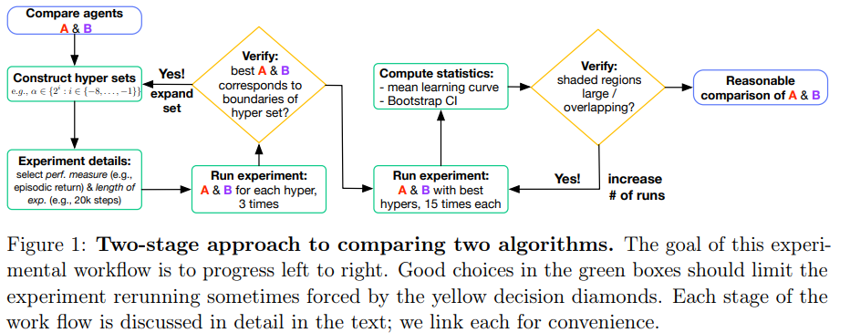
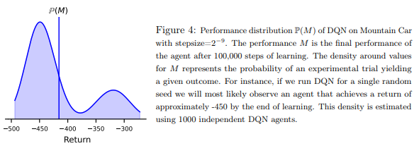

# [Empirical Design in Reinforcement Learning](https://arxiv.org/pdf/2304.01315)

## Abstract

* Recent studies have highlighted how popular algorithms are sensitive to hyperparameter settings and implementation details, and that common empirical practice leads to weak evidence.
* This manuscript represents both a call to action and a comprehensive resource on how to do good experiments on Reinforcement Learning.
* Covers:
  * Statistical assumptions underlying common performance measures
  * how to properly chracterize performance variation and stability
  * hypothesis testing
  * comparing multiple agents
  * base and illustrative example construction,
  * and how to deal with hyper parameter and experimenter's bias

* The objective is to provide answers on how we can use our unprecedented compute to do good science in Reinforcement Learning, as well as to avoid pitfalls in our empirical design

## Sections

1. Reinforcement Learning, an Empirical Science
2. Observational Experiments
   1. Experiment one: a demonstration
   2. Experiment two: characterizing variations in performance
   3. Distributions matter!
   4. Reporting variability in performance
   5. Reporting confidence in performance estimates
   6. Do we really need more runs?
   7. Deciding on the length of an experiment
3. Dealing with Hyperparameters
   1. Understanding hyperparameter sensitivity
   2. Reporting idealized perfomance
   3. Evaluating algorithms for deployment
4. Comparing the Performance of Multiple Algorithms
   1. Designer's curse: with great knowledge comes great responsability
   2. The utility of calibration baselines: what does that line mean anyway?
   3. Ranking algorithms (maybe don't)
   4. Statistically significant comparisons for two fully-specified algorithms
   5. Statistically significant comparisons for multiple fully-specified algorithms
5. Selecting Environments
   1. Diagnostic environments
   2. Benchmark experiments and challenge problems
   3. New (or modified) environments are not always better
6. Common errors in RL experiments
7. Case study: reevaluating previous work
8. Conclusion

Appendix:

1.  Summary of Contributions
2.  Further Experimental Details
    1.  ESARSA and the GridWorld
3.  Computing Tolerance Intervals
4.  More about Hyperparameter Selection
    1.  Understanding hyperparameter sensitivity for multiple parameters
    2.  Developing algorithms and avoiding misleading yourself
    3.  Why can't we just use cross-validation?
    4.  Cross-validation-like procedures for hyperparameter selection
    5.  Even more about treating the hyperparameter optimizer as the algorithm
5.  Agreggating Environments
6.  Understanding our Agents with Multiple Evaluation Metrics
    1.  Measuring the performance of an agent
    2.  Summarizing performance over time
    3.  Offline returns versus online returns

## 1. Introduction

* Methodology can impact the credibility of the result, ranging from insightful to misleading
* The task of evaluating a RL agent is complicated due to its fundamental aspect: an agent interacting with an environment
  * This interaction makes fair comarisons and scientific reproductivity major challenges in RL
  * Many of the ideas from classical Machine Learning such as overfitting, cross-validation, and model selection are diffferent or non-existent in RL.
  * Thus, the community is experiencing the consequences of limited reproductivity, experimenter bias, unreliable algorithms, and exagerated performance claims
* This document makes a distinction:
  * __demonstrations of (impressive) engineered systems__:
    * exploratory science, probing the edges of what is known before following with a more through empirical study
    * Demonstrating the capabilities of existing algorithms, in hard problems or applications
    * TD-Gammon 1995
  * __scientific studies in RL__:
    * Aim to obtain a deeper understanding of the systems and algorithms
    * Clear hypothesis that is falsifiable and controls for confounding effects
    * The aim should not be to show an algorithm is good, but rather understand an algorithm's properties, potentially relative to other algorithms
    * Complementary to theoretical analysis
* Many of the widely bemoaned poor empirical practices could be due to mistakenly applying practices common in other communities

* This document aims to be a reference to how to run good experiments in RL 
  * Walk through important design decisions, common mistakes, hidden biases

## 2. Observational Experiments

* In an observational study, the experimenters do not attempt to control the outcome of the study.
  * Classic example: "bake_off"-style, where several baseline algorithms are tested along several baseline environments.
* Because much of RL research occurs in deterministic simulation, we can lose sight of our goal as empiricists.
* Goals:
  * Evaluate the quality of a policy through the use of a value function for an specific agent
  * Repeated trials to understand performance accross multiple agents of a given algorithm, environment and experimental setup

Terminology:

* Agent: single entity interacting with an environment
* Algorithm: process which produces a set of agents, by specifying their initial conditions and learning rules
  * Fully-specified algorithm: an algorithm with a specific hyperparameter configuration
  * Unspecified algorithm. algorithm where some (or all) hyperparameters have not been configured

### 2.1 Experiment one: a demonstration

* How well does algorithm A perform on environment E?

* Decisions to be made:
  * How many time steps
  * artificial end of an episode after n steps
  * how many episodes if an episodic task

* Example:
  * If an optimal policy can get to the end in 15 time steps and the discount is 0.99, the optimal episodic return is $0.99^(15)$.
  * Use a fixed number of steps (not episodes!):
    * To better measure online performance
    * To avoid highly variable runtimes
    * Can change depending on what we need to measure
  * The curve has a step profile because just a single run of the experiment and step return.
  * Summarized as the average over the learning curve: return rate : It can change

### 2.2 Experiment two: characterizing variations in performance

* Most of the time we are interested in results that capture the variability of our algorithm
* Two main sources of variability (nature vs nurture)
  * Agent initialization (often randomized)
  * Environment stochasticity
* We do not make claims about an algorithm just from the behaviour of one agent, like scientists don't conclude about a species from one individual rat.

### 2.3 Distributions matter!

* The variability in performance accross agents due to initialization and environment random seed and noise parameters gives rise to a distribution over performance for our algorithm.
* Important for evaluating the algorithms performance and stablishing the number of experiments.

